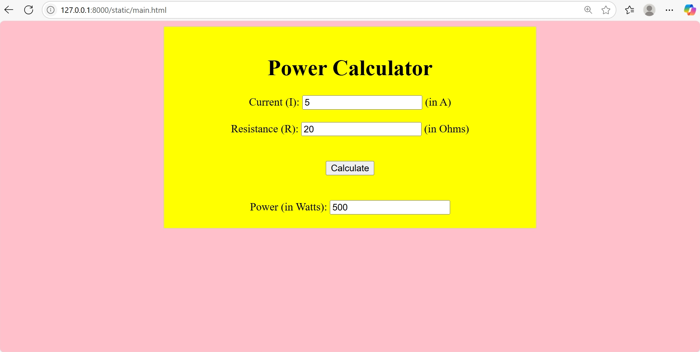

# Ex.05 Design a Website for Server Side Processing
## Date: 14.05.2025

## AIM:
 To design a website to calculate the power of a lamp filament in an incandescent bulb in the server side. 


## FORMULA:
P = I<sup>2</sup>R
<br> P --> Power (in watts)
<br> I --> Intensity
<br> R --> Resistance

## DESIGN STEPS:

### Step 1:
Clone the repository from GitHub.

### Step 2:
Create Django Admin project.

### Step 3:
Create a New App under the Django Admin project.

### Step 4:
Create python programs for views and urls to perform server side processing.

### Step 5:
Create a HTML file to implement form based input and output.

### Step 6:
Publish the website in the given URL.

## PROGRAM :
main.html
```
<!DOCTYPE html>

<head>
    <title>Server Side Processing</title>
    <link rel="stylesheet" href="style.css">
    <script>
        function power() {
            var current = Number(document.getElementById("t1").value);
            var resistance = Number(document.getElementById("t2").value);
            var pow = current * current * resistance
            document.getElementById("power").value = pow;
        }
    </script>
</head>

<body>
    <div class="container">
        <center>
            <h1>Power Calculator</h1>
            <label>Current (I):</label>
            <input type="number" id="t1"> (in A)
            <br><br>
            <label>Resistance (R):</label>
            <input type="number" id="t2"> (in Ohms)
        </center>
        <br><br>
        <center>
            <input type="button" onclick=power() value="Calculate">
        </center>
        <br><br>
        <center>
            <label>Power (in Watts):</label>
            <input type="number" id="power">
        </center>
    </div>
</body>
```
style.css
```
.container {
    width: 50%;
    margin: 0 auto;
    padding: 20px;
    border: 1px solid #ccc;
    background-color: yellow;
}

body {
    background-color: pink;
}
```

## SERVER SIDE PROCESSING:


## HOMEPAGE:



## RESULT:
The program for performing server side processing is completed successfully.
